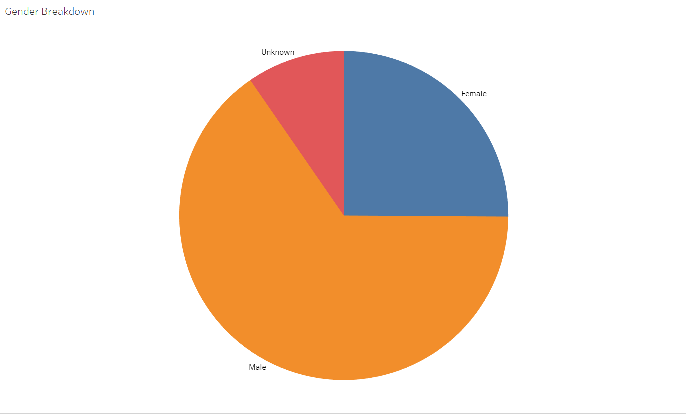
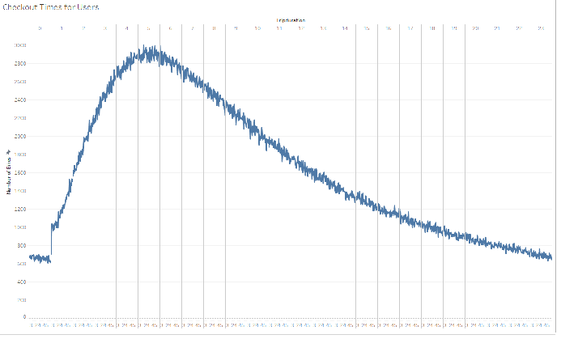
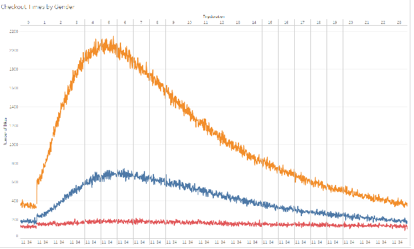
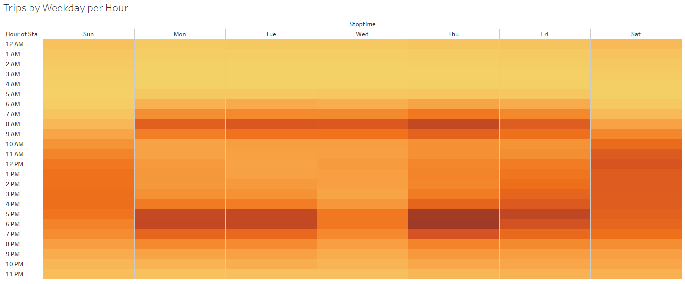
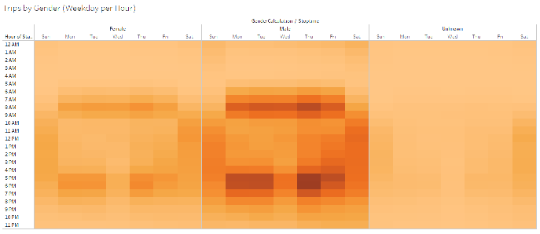
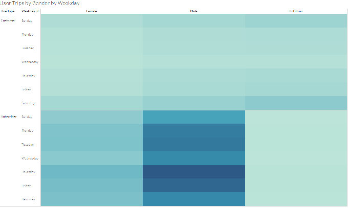
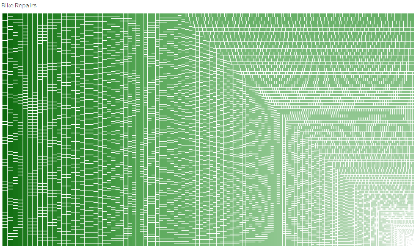

# bikesharing

## Overview of Analysis

### Purpose

This analysis was conducted to determine the viability of creating a bike sharing service for Des Moines, Iowa. 

### Resources

It was done using data from the New York City bike sharing service, Citi Bike.
- 201908-citibike-tripdata.csv

## Results

[Here is the link to the Tableau Story.]()

### Gender Breakdown

A pie chart showing the makeup of the riders.

---

### Checkout Times by Users

A line graph highlighting the highest and lowest volume for riders, by hour of the day.

---

### Checkout Times by Gender

A line graph showing rider volume for hours in the day, broken out into gender.

---

### Trips by Weekday per Hour

A heat map demonstrating the volume by day of the week and hour of the day.

---

### Trips by Gender by Weekday per Hour

A heat map demonstrating the volume by day of the week and hour of the day, broken out into gender.

---

### User Trips by Gender by Weekday

A heat map showing what days of the week have the most volume for each gender category, broken out into groups of subscribers and single use riders.

---

### Bike Repairs

A chart depicting the number of bikes and the number of times they are used.

---

## Summary

We can definitively conclude that males are more likely to use the bike share than females. Also, the early hours of the morning would be a favorable time to repair bikes. Unfortunately, no data was given for the city of Des Moines, so it is not possible to scale these results to see what the ridership would look like there.

### Future visualizations
Two more visualizations that could be ascertained from the data we do have:
1. Start/stop locations, by volume, for each gender and age group
2. User type by age group